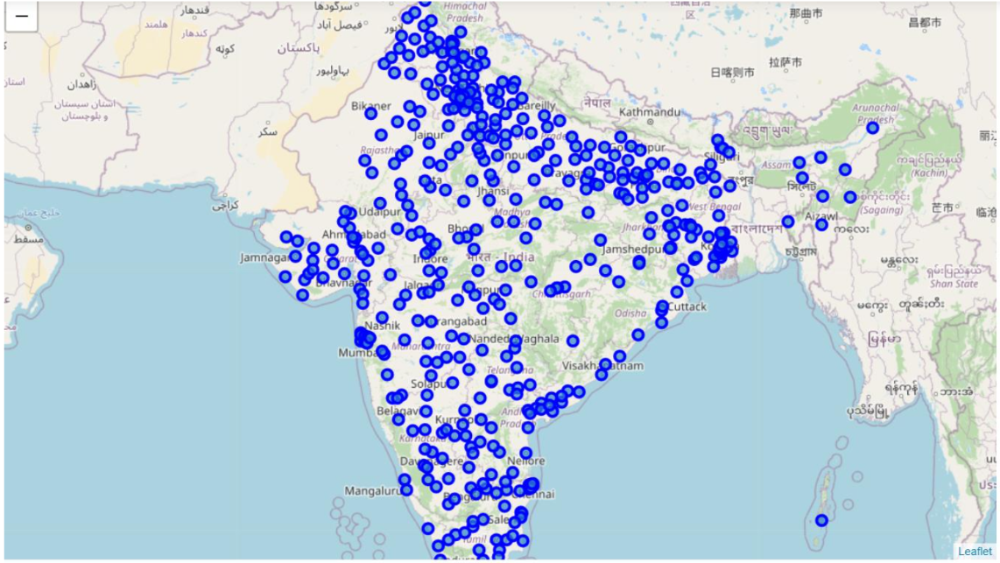
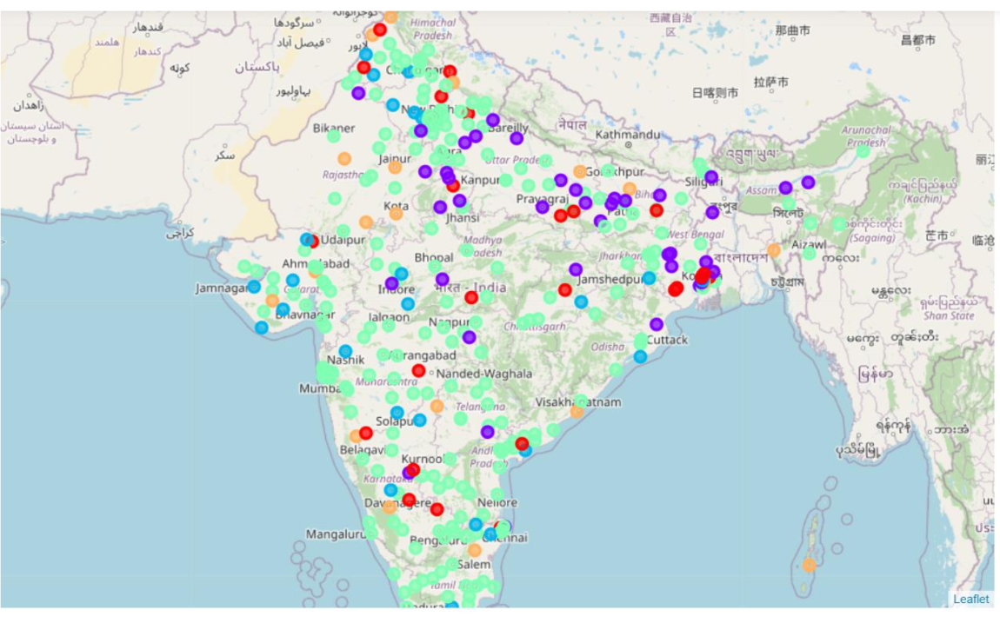
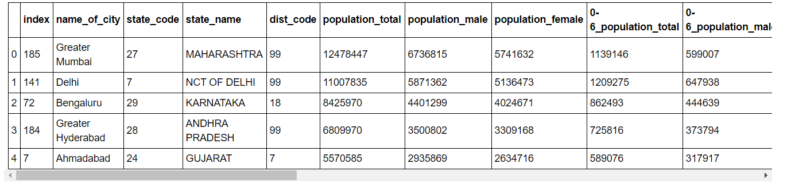
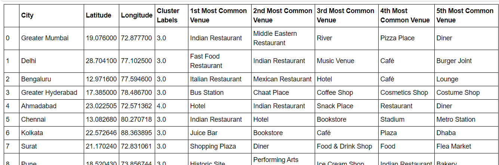

# IBM Applied Data Science Capstone Project
## Indian Cities And What Different People Could Get From Them
### What this project is about
#### Background 
India is a developing country with a very diverse group of people. Along with the state in which it is in development, population is also a major factor of how different categories of people tend to take decisions concerning various situations from the decision of finding a good place/city to live pertaining to their needs, to the decision of how a particular city might affect a certain business or a company. In a developing country like India, these decisions become very crucial in transforming the lives of people and the overall growth of country as a whole.
#### Problems / Questions To Consider
Different categories of people like normal people who might want to transit to a different city based on how the other city is similar to another, which business could be more profitable in a particular city or how the city's current state might affect one's decision or business, view the city or a region with different perspectives for obvious reasons. So, it becomes important for them to have a clear idea of how a particular city is ideally suited for their needs. It becomes important to know as to how the overall cities of India are distributed in terms of development and demands pertaining to different groups of people and how they can fulfil their respective needs by knowing the current state of where these cities stand and potentials that these cities have for satisfying their needs. So, to reveal the insights for such people seeking answers, this project takes into account the venues of the city as a way of identifying patterns of how certain cities are similar to one another and what their distribution is in terms of various factors that have impact on people's decisions. This project in a way, also lays emphasis on how a particular city may be lacking in terms of a particular aspect, because this also plays an important role in getting important insights of their characteristics.

#### Audience
The primary audience of this investigational project might include, people who want to take decision to make a transit to another city, depending on how that another city is similar to his/her current city of residence, or how the another city may be better in terms of standard
of living and various opportunities it might have to offer, or businessmen who want to know how a particular city could be potentially an ideal centre for a certain business to be pursued there.
This project as a whole, based on how various cities are different and or similar to one another, provides recommendations to a supposedly bigger audience based on what their perspectives and needs are.

A glimpse of the dataset: 

